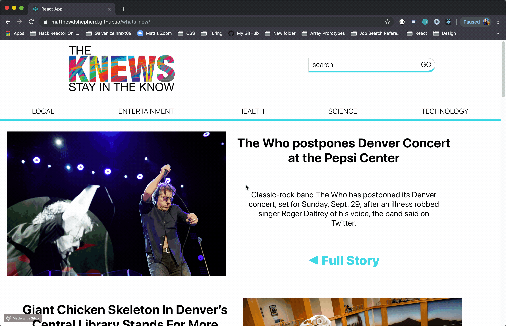

# The Knews - stay in the know

## Table of contents
* Built With 
* Screenshots
* Features
* Try It Out
* Take It For A Spin
* Why'd I Do This?

## Built With

- HTML5
- CSS3
- JavaScript
- React
- TDD (Jest, Enzyme)
- OOP
- Fetch API

## Screenshots

- Overlook allows us to design and create the UI/UX
  
### Actual:
  

## Features

- [x] Click desired topic to view related news
- [x] Fetch data
- [x] Search through selected topic
- [x] Built on react
customers

## Try It Out

1. View the hottest current news titles.

2. Click on the diferent news topics to see related news.

3. Search through the current news topic.

## Take It For A Spin

View <a href=https://matthewdshepherd.github.io/whats-new//>here</a> on GitHub.

## Why'd I Do This?

I am a student at Turing School of Software and Design, whom provioded the project specifications and website design. I am learning all the things on my way to becoming a Software Engineer.